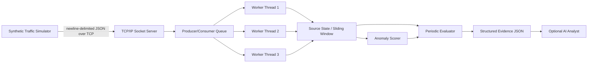

# CardShield Edge

Embedded, multithreaded payment-abuse detection for merchants.

## Problem

Payment abuse and card-testing behavior can appear as behavioral patterns
before it is useful to think about individual payment attempts. A merchant
may see bursts of requests, high failure ratios, unusually regular timing, or
rapid changes in client fingerprints and synthetic payment tokens. The
defensive challenge is to identify suspicious behavior without handling real
card numbers.

CardShield Edge uses synthetic identifiers and tokens only. It never captures
or stores real card numbers.

## Solution

The MVP pipeline is:

```text
Synthetic payment events
  -> TCP socket server
  -> fixed worker thread pool
  -> per-source sliding behavioral windows
  -> deterministic anomaly scoring
  -> NORMAL / SUSPICIOUS / ATTACK
  -> structured JSON evidence
  -> optional AI analyst explanation
```

Detection is deterministic and implemented in C++. The LLM is an optional
analyst and explainer: it receives structured evidence after the C++ detector
has made its decision, and it does not make or replace that decision.

The current system is defense-only. It does not automatically block or ban
traffic.

## Architecture



The listener, fixed worker pool, and periodic evaluator use standard C++
threads and synchronization. The queue is protected by a mutex and
`condition_variable`; the shared per-source state map is protected by a
mutex. The evaluator snapshots source state under that mutex and scores the
snapshot outside the lock.

## Detection Signals

The current detector uses these behavioral signals:

- **Velocity:** request count in the 60-second window, normalized against 1
  request/second.
- **Failure ratio:** failed payment attempts divided by requests in the
  window.
- **Timing anomaly:** regularity based on the coefficient of variation of
  sorted inter-arrival times.
- **Fingerprint anomaly:** distinct fingerprint ratio in the window.
- **Concentration:** currently contributes `0.0`.

The fixed weighted score is:

```text
30% velocity
30% failure ratio
20% timing anomaly
15% fingerprint anomaly
 5% concentration
```

Classification thresholds are:

```text
< 0.30         NORMAL
0.30 to < 0.65 SUSPICIOUS
>= 0.65        ATTACK
```

For binary held-out evaluation, `SUSPICIOUS` and `ATTACK` are both treated
as predicted `ATTACK`.

## Multithreading / Networking

The implementation uses C++17 and TCP/IP sockets. The listener accepts
newline-delimited JSON events and places valid events on the existing
producer/consumer queue. A fixed pool of three worker threads consumes events
and updates the shared per-source state map. A separate periodic evaluator
thread snapshots state and emits evidence for suspicious sources.

The queue uses a mutex and `condition_variable`. Shutdown uses one shared
atomic stop flag and explicit thread joins. The design uses a fixed worker
pool rather than creating a thread per connection, keeping concurrency bounded
and avoiding unnecessary thread creation under traffic.

## Evaluation

The repository includes a deterministic synthetic dataset of 80 examples:

- 30 normal users
- 10 high-volume legitimate users
- 20 card-testing bots
- 10 high-failure-but-slow sources
- 10 regular-timing low-failure bots

The dataset is split into 56 development/train examples and 24 held-out test
examples using fixed random seed `20260905`. The detector has no learned
training phase; the train split is included to demonstrate separation from
the held-out test set.

Held-out confusion matrix:

```text
TP = 8
TN = 10
FP = 6
FN = 0
```

Metrics:

- Precision: **57.14%**
- Recall: **100%**
- F1: **72.73%**
- False-positive rate: **37.5%**
- False-negative rate: **0%**
- False-positive cost: **6 synthetic cost units**, using the documented
  assumption of 1 synthetic cost unit per false positive

On the current small 24-source held-out synthetic set, the detector achieved
100% recall and 72.73% F1, with zero false negatives. Precision was 57.14%
and the false-positive rate was 37.5%. This reflects a deliberate current
preference for catching all attack examples rather than minimizing false
positives.

These results are directional rather than statistically robust because the
held-out set is small and synthetic. A production system would require a
substantially larger, more diverse, merchant-specific evaluation set and
threshold tuning against real operational costs.

## AI Analyst

`ai-analyst/explain.py` is a standalone demo analyst layer. It accepts one
structured evaluator evidence object, sends that evidence to an LLM, and
requests a short plain-English explanation that references the strongest
behavioral signals.

The analyst may recommend only:

- `monitor`
- `recommend rate-limit`
- `escalate to merchant`

It does not block or ban traffic, does not replace the C++ detector, and is
not integrated into the engine. It requires an `OPENAI_API_KEY` environment
variable and uses the OpenAI Chat Completions API. The intended flow is:

```text
C++ detector -> structured evidence JSON -> standalone AI explanation
```

The LLM explains an existing decision; it does not make the detection
decision.

## Defense-Only Design

CardShield Edge is intentionally defensive:

- synthetic data, identifiers, and tokens only
- no real card numbers
- no credential collection
- no offensive capabilities
- no automated blocking
- risk decisions produce structured evidence for review
- AI provides explanation, not autonomous enforcement

## Project Structure

Important project areas include:

```text
edge-engine/
  include/ and src/       C++ engine, networking, queue, state, and scoring
simulator/                 normal, attack, mixed, and dataset generation
scripts/
  split_dataset.py        reproducible 70/30 dataset split
  evaluate.py             held-out fixed-formula evaluation
  run.ps1                 Windows MSYS2 runtime launcher
dataset/
  full_dataset.jsonl      synthetic labeled dataset
  train.jsonl             development split
  holdout.jsonl           held-out split
ai-analyst/
  explain.py              standalone LLM analyst demo
```

## Build and Run

The documented Windows workflow uses CMake and the MSYS2 UCRT64 toolchain:

```powershell
cmake -S . -B build -G "MinGW Makefiles"
cmake --build build --parallel
```

Use the project-local launcher so `C:\msys64\ucrt64\bin` is placed before
other runtime directories in `PATH`:

```powershell
.\scripts\run.ps1 engine
.\scripts\run.ps1 simulator --mode mixed --duration 30
```

The launcher changes `PATH` only for the launched process and does not modify
the global Windows environment or copy DLLs into the repository.

Generate the synthetic dataset:

```powershell
.\build\simulator\cardshield-simulator.exe --mode dataset-gen
```

Split and evaluate the held-out data:

```powershell
python scripts/split_dataset.py
python scripts/evaluate.py
```

Linux and Raspberry Pi deployment have not been verified. They are not part
of the current documented MVP runtime workflow.

## Engineering Verification

The completed verification work established these behaviors in the current
environment:

- TCP server operation
- valid, malformed, missing-field, and wrong-type JSON handling
- concurrent queue load: 2,000 produced and 2,000 consumed
- multiple worker threads active at runtime
- sliding-window addition and out-of-order eviction
- failure ratio calculation
- sorted inter-arrival timing calculation
- token and fingerprint ratios
- periodic evaluator operation
- structured evidence JSON with required fields
- clean Ctrl+C shutdown with joined threads
- normal, attack, and mixed simulator traffic behavior when launched with the
  project-local runtime setup

These checks demonstrate MVP behavior in the current environment; they are
not production guarantees.

## Limitations / Future Work

The current MVP boundary is explicit:

- the held-out set is small and synthetic
- the current false-positive rate is high
- a larger evaluation dataset is needed
- merchant-specific threshold tuning is needed
- the concentration signal is currently unused
- the AI analyst is standalone
- Linux and Raspberry Pi deployment are future work
- Razorpay test-mode integration is future work
- a production dashboard is future work

## Why This Matters

CardShield Edge demonstrates systems engineering across TCP networking,
bounded multithreading, synchronized state, deterministic behavioral
detection, measurable evaluation, and explainability. Its defense-only design
keeps risk decisions grounded in synthetic telemetry while making the result
reviewable by both deterministic evidence and an optional analyst layer.
